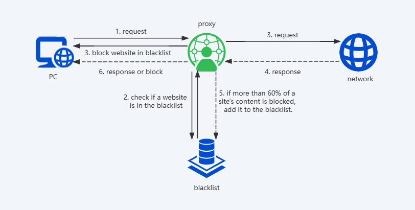

# InPurity
The Chinese version of this document is available [here](README.zh.md).

InPurity is a Windows service application to block porn pictures. It consists of a main service and a guardian service that stops your computer from displaying pornographic images, freeing your brain from the dopamine trap and returning you to real life. After a period of "cleansing", you'll be able to find the purity of your heart and feel the beauty of life.

## How does it work?
This program installs two services: a main service and a daemon service.

- **Main Service**:  
  The main service starts the local mitmproxy proxy. When the local proxy receives a request, it first checks if the URL is in the blacklist. If it is, the request is blocked immediately. If it is not, the request is forwarded. Once a response is received, the program uses the MobileNet model to analyze images in the response to determine if they are appropriate. If the content is appropriate, the response is returned as normal. If not, an error response is sent back. ~~For video content, the program performs frame-by-frame analysis.~~ If 60% or more of the responses from a particular URL are deemed inappropriate, the URL is added to the blacklist.

- **Daemon Service**:  
  The daemon service monitors the status of the main service and checks for changes to the Windows proxy settings to prevent the service from being stopped or the proxy from being disabled unexpectedly.

## Acknowledge
This project makes use of the following open-source project:

- **[mitmproxy](https://github.com/mitmproxy/mitmproxy)**
  An interactive TLS-capable intercepting HTTP proxy for penetration testers and software developers.

- **[Deep NN for NSFW Detection](https://github.com/GantMan/nsfw_model)**  
  Developed by Gant Laborde. A deep neural network model for detecting NSFW content.

## License
This project is licensed under the [MIT License](LICENSE).

## Contributing and Development
We warmly welcome contributions and encourage developers to build upon this project! Whether you want to fix bugs, suggest new features, improve documentation, or adapt the project for your own needs, your input is greatly appreciated. 